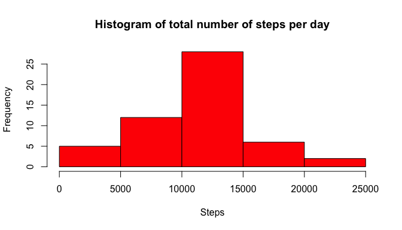
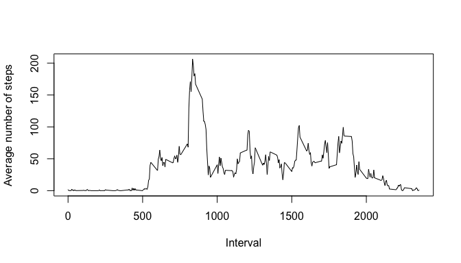
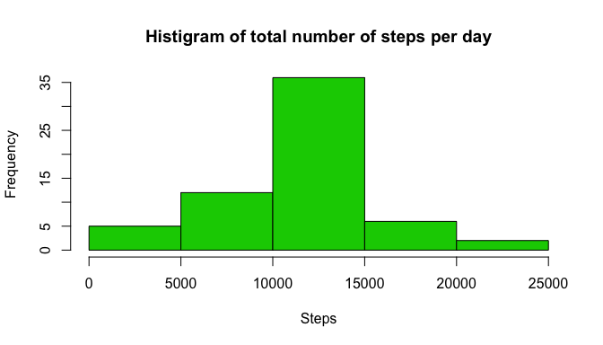

### Loading and preprocessing the data

```r
library(dplyr)
library(ggplot2)
html <- "https://d396qusza40orc.cloudfront.net/repdata%2Fdata%2Factivity.zip"
download.file(html, destfile = "data_activity.zip")
unzip("data_activity.zip")
data_activity <- read.csv("activity.csv", header = TRUE)
data_activity$date <- as.Date(data_activity$date, format = "%Y-%m-%d")
new_data <- na.omit(data_activity)
steps <- new_data$steps
date <- new_data$date
interval <- new_data$interval
```
### What is mean total number of steps taken per day?

1. Calculate the total number of steps taken per day

```r
n_steps <- aggregate(steps, by=list(date = date), FUN=sum)
```

2. Make a histogram of the total number of steps taken each day
Creating the histogram

```r
hist(n_steps$x, col = 2, xlab = "Steps", main = "Histogram of total number of steps per day")
```

<!-- -->

3. Calculate and report the mean and median of the total number of steps taken per day

```r
mean_steps <- mean(n_steps$x)
median_steps <- median(n_steps$x)
```
The mean number of steps is 1.0766189\times 10^{4} while the median is 10765

### What is the average daily activity pattern?

1. Make a time series plot (i.e. type = "l") of the 5-minute interval (x-axis) and the average number of steps taken, averaged across all days (y-axis)

```r
st_int <- aggregate(steps~interval, FUN = mean)
plot(st_int$interval, st_int$steps, type = "l", xlab = "Interval", ylab = "Average number of steps")
```

<!-- -->

2. Which 5-minute interval, on average across all the days in the dataset,
contains the maximum number of steps?

```r
st_int[which.max(st_int$steps),]
```

```
##     interval    steps
## 104      835 206.1698
```

#### Imputing missing values

Note that there are a number of days/intervals where there are missing values
(coded NA). The presence of missing days may introduce bias into some calculations
or summaries of the data.

1. Calculate and report the total number of missing values in the dataset (i.e. the total number of rows with NAs)


```r
sum(is.na(data_activity))
```

```
## [1] 2304
```
The total umber of missing values is 2304

2. Devise a strategy for filling in all of the missing values in the dataset.
The strategy does not need to be sophisticated. For example, you could use
the mean/median for that day, or the mean for that 5-minute interval, etc.

3. Create a new dataset that is equal to the original dataset but with the
missing data filled in.


```r
for (i in 1:nrow(data_activity)){
  if (is.na(data_activity$steps[i])){
    int_val <- data_activity$interval[i]
    row_id <- which(st_int$interval == int_val)
    steps_val <- st_int$steps[row_id]
    data_activity$steps[i] <- steps_val
  }
}
```
Checking if there are any NAs left

```r
sum(is.na(data_activity))
```

```
## [1] 0
```


4. Make a histogram of the total number of steps taken each day and
Calculate and report the mean and median total number of steps taken per day.
Do these values differ from the estimates from the first part of the assignment?
What is the impact of imputing missing data on the estimates of the total daily
number of steps?


```r
n_steps2 <- aggregate(data_activity$steps, by=list(date = data_activity$date), FUN=sum)
hist(n_steps2$x, col = 3, xlab = "Steps", main = "Histigram of total number of steps per day")
```

<!-- -->

```r
mean_steps2 <- mean(n_steps2$x)
median_steps2 <- median(n_steps2$x)
mean_steps2
```

```
## [1] 10766.19
```

```r
median_steps2
```

```
## [1] 10766.19
```
There are some minor changes in the median while the mean remained the same.

#### Are there differences in activity patterns between weekdays and weekends?

1. Create a new factor variable in the dataset with two levels ??? "weekday" and "weekend" indicating whether a given date is a weekday or weekend day


```r
data_activity$weekday <- weekdays(data_activity$date)
data_activity$weekday <- ifelse(data_activity$weekday %in% c("Saturday", "Sunday"), "Weekend", "Weekday")
data_activity$weekday <- as.factor(data_activity$weekday)
```

2. Make a panel plot containing a time series plot (i.e. type="l") of the 5-minute interval
(x-axis) and the average number of steps taken, averaged across all weekday days or weekend
days (y-axis). See the README file in the GitHub repository to see an example of what this
plot should look like using simulated data.


```r
steps_week <- aggregate(steps ~ interval + weekday, data = data_activity, mean)
ggplot(steps_week, aes(x = interval, y = steps, xlab = )) +
  xlab("Interval") + ylab("Steps") +
  geom_line() +
  facet_wrap(~weekday, ncol = 1)
```

<!-- -->


